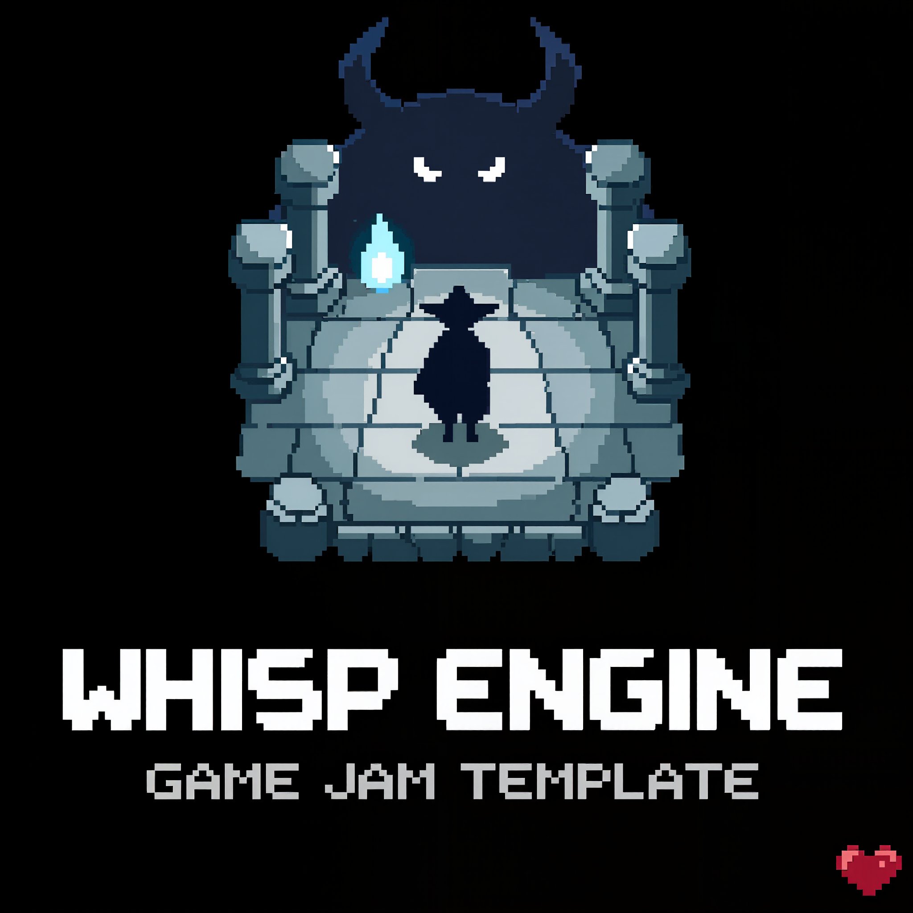

<p align="center">
  
</p>

<h1 align="center">Wisp Engine – Game Jam Template</h1>

<p align="center">
  <strong>A complete, playable 2D arena game in Go + TinyGo + WebAssembly — clone it, reskin it, ship it before the jam ends.</strong>
</p>

<p align="center">
  <a href="https://go.dev/"></a>
  <a href="https://tinygo.org/"></a>
  <a href="LICENSE"></a>
  <a href="https://github.com/andygeiss/game-jam-template/generate"></a>
</p>

---

Most game jam templates hand you an empty window and wish you luck. This one hands you a **finished game**: a hero, ten monsters, a boss fight, three abilities with cooldowns, hearts, hit sounds, a music loop, camera shake, a game-over screen, a victory screen and a restart key — all rendering in the browser from a 300 KB WASM binary.

Your job is to make it *yours*: swap the sprites, tweak the numbers, add a mechanic. The boring parts are done.

## ✨ What's in the box

| | |
|---|---|
| 🎮 **A complete game loop** | Idle → fight → boss → win or game over → restart. No placeholder screens. |
| 🗡️ **Three abilities** | Melee strike, projectile burst and a dash with invincibility frames — each with its own cooldown shown in the HUD. |
| 👹 **A boss encounter** | Spawns once the arena is cleared, holds the center, has 10 lives, fires volleys of energy balls, and announces itself with a screen shake. |
| 🎨 **Pixel-art assets, sources included** | `.aseprite` files for the hero, boss, tileset and UI so you can edit instead of redraw. |
| 🔊 **Sound & music** | Attack and hit effects plus a looping soundtrack, wired up and ready to replace. |
| ⚡ **Tiny, fast WASM** | Built with TinyGo and squeezed with `wasm-opt`. Data-oriented, near-zero allocations, minimal JS↔WASM crossings. |
| 🖥️ **Production-ready server** | Go standard library only: security headers, CSRF protection, graceful shutdown, structured logs, a localhost ops listener with `/healthz` and pprof, and the container files the operations repository expects. |
| 📦 **One-command everything** | `make wasm` compiles the game, `make run` starts the server, `make` runs every gate. |

## 🕹️ Controls

Click the canvas to start. Clear all ten monsters to summon the boss; take its ten lives to win.

| Key | Action |
|-----|--------|
| `W` `A` `S` `D` | Move |
| `Q` | Strike (1 s cooldown) |
| `E` | Projectile burst (3 s cooldown) |
| `R` | Dash — 4× speed, invincible (5 s cooldown) |
| `F` | Fullscreen |
| `N` | New game |

## 🚀 Quick start

**Prerequisites:** [Go 1.26](https://go.dev/dl/), GNU Make (ships with the macOS Command Line Tools), and — to rebuild the game — [TinyGo 0.41 or newer](https://tinygo.org/getting-started/install/) and [Binaryen](https://github.com/WebAssembly/binaryen) (`wasm-opt`).

```sh
# 1. Create your own repo from this template, then clone it
git clone https://github.com/<you>/<your-game>.git
cd <your-game>

# 2. Compile the game (needs TinyGo + wasm-opt)
make wasm

# 3. Start the server
make run
```

Then open <http://127.0.0.1:8080/>.

The repository ships a compiled `web/static/game.wasm`, so `make run` works before TinyGo is installed. Run `make wasm` after every change to `cmd/client` or `internal/engine`, and commit the new `game.wasm` with it.

### Installing TinyGo on macOS

`brew tap tinygo-org/tools && brew install tinygo binaryen` builds TinyGo from source and needs a current Xcode. Without one, unpack the release tarball and put it on your `PATH`:

```sh
curl -fsSL https://github.com/tinygo-org/tinygo/releases/download/v0.41.1/tinygo0.41.1.darwin-arm64.tar.gz | tar -xz -C ~/.local
export PATH="$HOME/.local/tinygo/bin:$PATH"
brew install binaryen
```

### Server configuration

Flags beat environment variables beat built-in defaults; `go run ./cmd/server -h` lists all of it. Every default works, so an empty environment starts a working server.

| Variable | Flag | Default | Purpose |
|----------|------|---------|---------|
| `HOST` | `-host` | `127.0.0.1` | Bind address |
| `PORT` | `-port` | `8080` | App listener port |
| `LOG_LEVEL` | `-log-level` | `info` | `debug`, `info`, `warn` or `error` |
| `ENV` | — | `dev` | `dev` (text logs) or `prod` (JSON logs) |

`make run` loads `.env` when the file exists (copy `.env.example`); nothing else reads it. The ops listener is fixed at `127.0.0.1:6060` and serves `/healthz` and `/debug/pprof/`.

### All targets

```sh
make          # every gate: gofmt, vet, go fix, staticcheck, govulncheck, tidy, tests, static build
make ci       # the same gates against the last commit
make wasm     # compile the game and copy the assets into web/static/
make run      # start the server (loads .env)
make test     # go test -race -shuffle=on ./...
make build    # release-shaped binary in bin/
make fmt      # goimports + go fix
make clean    # rm -rf bin/
```

### Container image

`Dockerfile`, `compose.yaml` and `.dockerignore` are the operations repository's templates; deploying follows its runbooks. To build the image on your machine:

```sh
docker build -t game-jam-template .
```

## 🧭 Project layout

```
assets/                 Sprites (.png + .aseprite), sounds and music — the sources
assets.go               Embeds web/ into the binary
cmd/client/main.go      The game — entities, abilities, boss, HUD (compiled to WASM)
cmd/server/             HTTP server: config, version stamp, wiring
internal/app/           Routes, middleware, the page handler, the ops listener
internal/engine/        The Wisp engine: entities, camera, input, animation (entity.go), browser glue (runtime.go)
web/templates/          The one page
web/static/             app.css, favicon, game.wasm, js/ (WASM loader), img/ and audio/ (copied by make wasm)
docs/                   Logo and documentation
DESIGN.md               The page's design tokens
Makefile                Every command
```

## 🛠️ Make it yours

1. **Reskin** — open `assets/*.aseprite`, redraw, export to the `.png` next to it, then `make wasm`. Keep the frame layout and everything just works.
2. **Rebalance** — every cooldown, life count and speed lives in the constants at the top of `cmd/client/main.go`.
3. **New arena** — edit the tile indices in `enterScene()` or replace `tileset.png`.
4. **New mechanic** — add a state bit, a handler like `handleAction3`, and a HUD icon. The dash is a good example to copy.
5. **New enemy** — `addMonsters()` and `addBoss()` show how entities, animations and collision masks fit together.

## 📐 Baseline deviations

This project follows the [engineering baseline](https://github.com/andygeiss/baseline). Three of its rules are waived here:

- **No hand-written JavaScript** ([stack/html.md](https://github.com/andygeiss/baseline/blob/main/stack/html.md)) — waived 2026-08-28 by Andy. The game is Go compiled to WebAssembly, and a browser can only start a WASM module from a script. Scoped to `web/static/js/`: `wasm_exec.js` is TinyGo's runtime glue, copied by `make wasm` and never edited; `wasm_app.js` is the ten-line loader. No build step, no npm; the CSP is updated to match (next entry).
- **CSP `script-src` carries `'wasm-unsafe-eval'`** ([patterns/security-headers.md](https://github.com/andygeiss/baseline/blob/main/patterns/security-headers.md)) — waived 2026-08-28 by Andy. Browsers refuse to compile WebAssembly under `default-src 'self'` alone. `'wasm-unsafe-eval'` allows WASM compilation only; `'unsafe-eval'` and `'unsafe-inline'` stay banned, and the test pins that neither appears. Scoped to the `csp` constant in `internal/app/middleware.go`.
- **`make check` has one line the baseline's does not** ([stack/makefile.md](https://github.com/andygeiss/baseline/blob/main/stack/makefile.md) rule 1) — waived 2026-08-28 by Andy. `GOOS=js GOARCH=wasm go vet` on the game, because the host vet never sees a `js && wasm` package. `ci` runs `check`, so the line is in both.

Conformance notes, for the reader who checks the boxes:

- `make wasm` is a rule-3 target: the one recurring command the gates cannot run.
- No htmx: the page has no hypermedia interaction, so the script would do nothing.
- No `DATABASE_URL`, and `/healthz` pings no database: the server holds no state.
- `web/static/game.wasm` is committed so that `make run`, `make ci` and the container build work without TinyGo. Rebuild it in the commit that changes the game.
- `Dockerfile`, `compose.yaml` and `.dockerignore` are the operations templates, changed only in the name, the alias, and the removed `secrets` blocks.

## 💡 About Wisp

Wisp is a minimal 2D engine written in Go and built for the single-threaded WASM runtime. It doesn't try to compete with big engines — it's a lean, readable foundation for learning how render loops, input, entity systems and cameras actually work, and for shipping small games fast. If you can read Go, you can read the whole engine in an afternoon.

## 📄 License

[MIT](LICENSE) — use it for your jam, your course, or your next commercial pixel-art hit.
